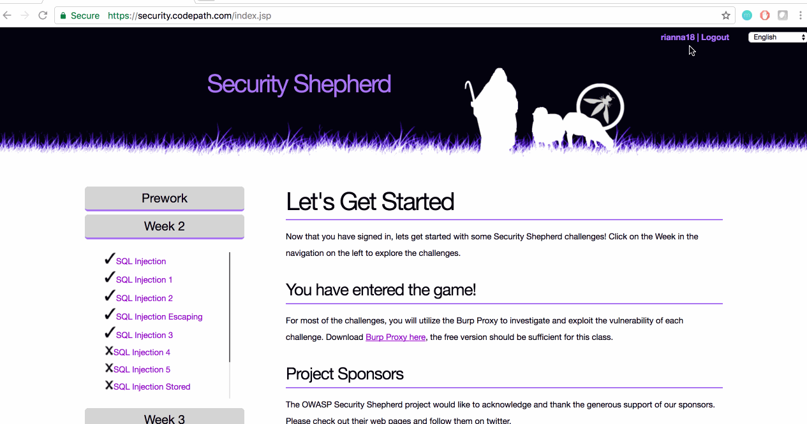

# Cybersecurity Week 2 Lab - rianna18

Time spent: 1.5 hours spent in total

## Project Description

This week's lab uses SQL language to find the the necessary result key by pulling up information in a table.
Major concepts used in this lab are statement types, syntax, clauses, and operators, which are all basic SQL. Form input is also used including validation and sanitization.

## User Stories

The following **required** functionality is completed:

1. [x]  Required: Challlenge 0 - SQL Injection 
2. [x]  Required: Challenge 1 - SQL Injection 1
3. [x]  Required: Challenge 2 - SQL Injection 2
4. [x]  Required: Challenge 3 - SQL Injection Escaping
5. [x]  Required: Challenge 4 - SQL Injection 3

The following advanced user stories are optional:

* [ ]  Bonus 1: SQL Injection 4
* [ ]  Bonus 2: SQL Injection 5
* [ ]  Bonus 2: SQL Injection Stored Procedure
* [ ]  Bonus 2: SQL Injection 6
* [ ]  Bonus 2: SQL Injection 7

## Video Walkthrough

Here's a walkthrough of implemented user stories:

GIF created with [LiceCap](http://www.cockos.com/licecap/).

## Notes

I have never worked with SQL and HTML language before, so I had to do a lot of learning before figuring out these challenges. I definitely found it interesting.

## License

    Copyright [2017] [Rianna Jawa]

    Licensed under the Apache License, Version 2.0 (the "License");
    you may not use this file except in compliance with the License.
    You may obtain a copy of the License at

        http://www.apache.org/licenses/LICENSE-2.0

    Unless required by applicable law or agreed to in writing, software
    distributed under the License is distributed on an "AS IS" BASIS,
    WITHOUT WARRANTIES OR CONDITIONS OF ANY KIND, either express or implied.
    See the License for the specific language governing permissions and
    limitations under the License.
